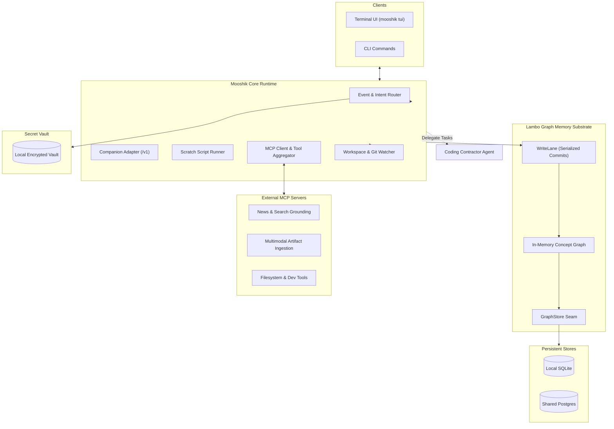

# Mooshik

Mooshik is an ambient, local-first AI cowork partner and workspace orchestrator. It runs continuously alongside you as a peer. It holds lifelong memory of your workspace, researches the web, and connects to your tools over MCP. When you need heavy code edits, Mooshik delegates them to specialized coding agents.

- **Authority Specification:** [docs/SPEC.md](docs/SPEC.md)
- **Build Plan:** [dev-diary/PLAN.md](dev-diary/PLAN.md)
- **License:** AGPLv3 (Application and Orchestration), Apache 2.0 (Lambo Memory Core)

---

## Architecture



---

## The Triad

Mooshik separates memory, orchestration, and coding execution into three clear roles.

| Role | Repository / Engine | Responsibility |
| :--- | :--- | :--- |
| **Mooshik** | `nrynss/mooshik` | Ambient awareness, fast local chat, research, MCP aggregation, and terminal UI. |
| **Lambo** | `nrynss/lambo` | Living graph memory substrate, in-memory graph, write-behind, and vector recall. |
| **Coding Contractor** | Delegated Agent | Surgical code edits in repositories under constraints provided by Lambo memory. |

---

## Installation

### One-Line Shell Installer

Run this command in your terminal to install the latest pre-compiled binary for Linux or macOS:

```sh
curl -fsSL https://raw.githubusercontent.com/nrynss/mooshik/main/install.sh | sh
```

### Build from Source

Install Rust 1.97.1 using rustup.

On Linux, install required D-Bus development headers:

```sh
sudo apt install libdbus-1-dev pkg-config
```

Build and test the binary:

```sh
cargo build --release
cargo test
./target/release/mooshik --help
```

---

## Quickstart

Initialize your Mooshik workspace:

```sh
mooshik init
```

Open the terminal user interface:

```sh
mooshik tui
```

Search your memory graph:

```sh
mooshik recall "deployment checklist"
```

Consolidate memory and generate prose summaries:

```sh
mooshik reflect
```

---

## Core Capabilities

### Ambient Workspace Awareness
The workspace watcher observes file modifications and git commits. It extracts durable concepts automatically while the terminal UI stays open. Live watching is currently Unix-only. On unsupported non-Unix platforms it fails closed at TUI startup. The watcher stops with the pane.

### Terminal User Interface
The terminal UI renders weekly logs, active threads, ribbons, and notes. It rebuilds the view model on every 250 millisecond tick.

### Encrypted Local Secret Vault
Mooshik stores credentials in an encrypted local vault. It redacts secrets before tool calls reach external models or processes.

### Pre-Wire Secret Scanning
The artifact extractor scans extracted text for credentials and tokens. It drops the entire document when it detects a secret.

### Multimodal Artifact Ingestion
The artifacts MCP server processes screenshots and audio recordings. It extracts structured decisions, relations, and values without polluting the graph with visual captions.

---

## Storage and Embedder Postures

Mooshik supports two deployment postures through `~/.mooshik/config.toml`:

| Posture | Store Kind | Embedder Kind | Requirements |
| :--- | :--- | :--- | :--- |
| **Local** | `sqlite` | `bge_m3` | Local llama.cpp server. No data leaves your machine. |
| **Shared** | `postgres` | `gemini` | Postgres connection string and Vertex AI credentials. |

---

## CLI Reference

| Command | Description |
| :--- | :--- |
| `mooshik init` | Creates home directory layout and configuration files. |
| `mooshik tui` | Launches the interactive terminal user interface. |
| `mooshik chat` | Starts a command-line conversation session. |
| `mooshik recall <query>` | Searches the concept graph and returns relevant context. |
| `mooshik stats` | Displays graph node counts and session health metrics. |
| `mooshik reflect` | Runs consolidation and writes prose descriptions. |
| `mooshik config show` | Displays active configuration with redacted secrets. |
| `mooshik config set <key> <val>` | Updates a configuration setting. |
| `mooshik secret set <name> <val>` | Stores a secret in the encrypted local vault. |
| `mooshik permissions list` | Lists all tool permission grants. |

---

## Documentation Site

Explore the full documentation in the `docs/` directory:

- [Getting Started & Installation](docs/src/content/docs/getting-started/overview.md)
- [System Architecture](docs/src/content/docs/architecture/system-overview.md)
- [Memory & WriteLane Concurrency](docs/src/content/docs/architecture/writelane-concurrency.md)
- [MCP Servers & Tools](docs/src/content/docs/mcp-and-tools/mcp-host.md)
- [CLI Reference](docs/src/content/docs/reference/cli.md)
