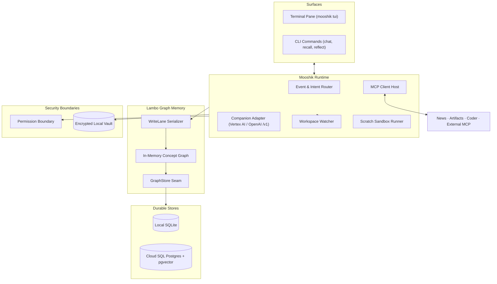

# Mooshik

Mooshik is an ambient, local-first cowork partner that sits with you while you work. It runs in a terminal pane beside your editor, holds long-term memory across sessions, and acts on your behalf.

### [Read the documentation at nrynss.github.io/mooshik](https://nrynss.github.io/mooshik/)

[Product Overview](https://nrynss.github.io/mooshik/overview/) ·
[Quickstart](https://nrynss.github.io/mooshik/quickstart/) ·
[Installation](https://nrynss.github.io/mooshik/installation/) ·
[Guided Setup](https://nrynss.github.io/mooshik/guided-setup/) ·
[Choosing a Posture](https://nrynss.github.io/mooshik/postures/) ·
[The Pane](https://nrynss.github.io/mooshik/tui-overview/) ·
[Lambo Memory](https://nrynss.github.io/mooshik/memory-and-lambo/) ·
[CLI Reference](https://nrynss.github.io/mooshik/cli/)

---

## Why Mooshik exists

Most AI assistants are stateless. You summon them for a prompt, they answer, and they forget the work.

Mooshik stays open in your workspace. It observes your progress, tracks decisions across projects, and removes obstacles without breaking your focus.

The name comes from ancient myth. Lambodaran (Ganesha) is the deity of intellect, memory, and the removal of obstacles. Mooshik is his companion and vahana, the mount that carries him into the world. The Sanskrit root *mus* means to extract and gather. Mooshik gathers context from your workspace and carries Lambo's memory into action.

---

## Mooshik and Lambo

Mooshik separates memory from interaction by embedding [Lambo](https://nrynss.github.io/lambo) in-process.

Lambo is a graph memory system for AI operations. It structures knowledge into entities, observations, and constraints. Concepts earn promotion through structural evidence and recurrence across time, rather than agent assertions. Lambo calculates blast radius to warn you when planned changes affect load-bearing decisions.

Mooshik links Lambo directly in Rust. You choose between two storage backends:
- **Local:** SQLite with local embeddings. No data leaves your machine.
- **Shared:** PostgreSQL with pgvector. A desktop and laptop share one continuous memory.

Read the [Lambo documentation](https://nrynss.github.io/lambo) for full scoring arithmetic and canonization details.

---

## What Mooshik does

- **Watches your workspace.** Observes file edits and git commits in your project root. Records that changes occurred without storing raw file text in memory.
- **Remembers across sessions.** Recalls past architecture choices, project conventions, and operational constraints by meaning.
- **Converses in the pane.** Streams companion responses directly in a terminal interface.
- **Researches the web.** Queries live sources through the news MCP server with cited Markdown output.
- **Extracts multimodal artifacts.** Extracts typed concepts from screenshots and audio recordings through the artifacts MCP server.
- **Runs sandboxed scripts.** Executes scratch Python or Bash snippets with timeouts and egress redaction.
- **Connects external tools.** Aggregates standard MCP servers as child processes over stdio.
- **Delegates code edits.** Hands large refactors to external coding agents under standing constraints from memory.

---

## Architecture



---

## Installation

Install the prebuilt binary and Python MCP servers on x86_64 Linux or Apple Silicon macOS:

```bash
curl -fsSL https://raw.githubusercontent.com/nrynss/mooshik/main/install.sh | sh
```

The installer places the `mooshik` binary in `~/.local/bin`. It installs the Python MCP servers into `~/.local/share/mooshik/venv`.

On systems without Python 3.10+, the installer sets up the binary and explains how to add servers later.

To build from source with Rust 1.97.1:

```bash
cargo build --release
```

---

## First run

Run the interactive setup:

```bash
mooshik init
```

The setup asks for your deployment posture, storage configuration, embedder, and inference credentials. All secrets are read without terminal echo and stored in the encrypted vault.

Launch the terminal interface from your project parent directory:

```bash
cd ~/work
mooshik tui
```

Mooshik watches the directory where you launch it. Launching from a common parent directory allows the watcher to track multiple repositories efficiently.

See the [CLI Reference](https://nrynss.github.io/mooshik/cli/) for secondary commands like `mooshik recall`, `mooshik chat`, and `mooshik reflect`.

---

## Security and privacy

- **Two separate stores.** Secrets live in an encrypted local vault at `~/.mooshik/vault`. Memory lives in the graph. The graph never stores secret values.
- **Egress redaction.** Tool outputs and error strings are scanned against vault values before reaching models.
- **Tool boundary grants.** Permissions are explicit grants in configuration. Memory read and write are allowed by default. Script execution prompts for confirmation. All other tools are denied by default.
- **Immutable permissions.** Memory concepts cannot alter or expand tool permissions.

---

## Built for the All Things Agentic Hackathon

Mooshik is built for the All Things Agentic Hackathon.

### Compliance matrix

| Category | Implementation | Verified source |
| :--- | :--- | :--- |
| **Gemini 3.5 or newer** | Companion runs `gemini-3.7-flash` on Vertex AI at the `global` location. Python servers use the same model default. | [`mooshik-common/mooshik_common/models.py`](mooshik-common/mooshik_common/models.py) |
| **Google Agent Framework** | The bootstrap ingester uses Google ADK. The artifacts MCP server uses ADK `LlmAgent` for multimodal extraction. | [`ingester/agent.py`](ingester/agent.py), [`mcp-servers/artifacts/server.py`](mcp-servers/artifacts/server.py) |
| **Google Cloud Infrastructure** | Cloud SQL PostgreSQL with pgvector acts as the shared cross-machine graph store. Cloud Run Jobs run the bootstrap ingester with Cloud SQL Auth Proxy. | [`ingester/README.md`](ingester/README.md), [`src/memory/ops.rs`](src/memory/ops.rs) |

Veo and Lyria were dropped because Mooshik does not generate media assets. Gemma is not configured in the active runtime.

### Measurement findings

We tested the claim that canonization filters extraction hallucination without semantic ground truth. The measurement harness in [`measurement/`](measurement/) evaluated the live graph built by the bootstrap ingester.

Results from milestone testing:
- **Embedding coverage:** 59.3%. This triggered the sub-90% warning gate, showing recall relied heavily on keyword matching.
- **Raw extraction precision:** 10/10, Wilson 95% interval [0.722, 1.000].
- **Canonical promotions:** 0. The canonical pool was empty. Every true extraction was initially counted as rejected.

The investigation revealed that Lambo's recurrence score requires evidence across distinct sessions over event time. The MCP wire protocol lacked an `event_time` field, causing historical commits spanning a decade to arrive with identical flush timestamps. Each concept appeared as a single session and failed the promotion threshold.

We resolved this by adding an optional `event_time` to Lambo's derive API (commit `71334f0`) and updating the ingester to pass commit dates. `created_at` remains server-stamped to preserve security boundaries.

### Submission checklist

- **Reproducibility:** Follow the installation and `mooshik init` instructions above.
- **Architecture diagram:** Included above.
- **Repository:** [https://github.com/nrynss/mooshik](https://github.com/nrynss/mooshik)
- **Hosted service:** Mooshik runs as a local binary and does not require a hosted web application.

---

## Status and roadmap

- **Phase 1: Terminal (Shipped).** Rust core runtime, embedded Lambo graph memory, interactive TUI, workspace watcher, reflection engine, and MCP server ecosystem.
- **Phase 2: Desktop (Roadmap).** Native desktop application with global summon hotkey, graph visualizer, and tray presence.

---

## Licensing

- **Mooshik Application:** [AGPL-3.0](LICENSE)
- **Lambo Memory Core:** [Apache-2.0](https://github.com/nrynss/lambo/blob/main/LICENSE)
