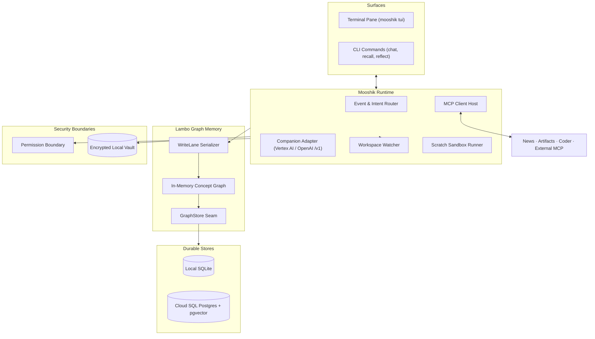

# Mooshik

[](https://github.com/nrynss/mooshik/actions/workflows/ci.yml)
[](https://github.com/nrynss/mooshik/releases/latest)
[](LICENSE)

Mooshik is an ambient, local-first cowork partner that sits with you while you work. It runs in a terminal pane beside your editor, holds long-term memory across sessions, and acts on your behalf.

### [Read the documentation at nrynss.github.io/mooshik](https://nrynss.github.io/mooshik/)

[Product Overview](https://nrynss.github.io/mooshik/overview/) ·
[Quickstart](https://nrynss.github.io/mooshik/quickstart/) ·
[Installation](https://nrynss.github.io/mooshik/installation/) ·
[Guided Setup](https://nrynss.github.io/mooshik/guided-setup/) ·
[Choosing a Posture](https://nrynss.github.io/mooshik/postures/) ·
[The Pane](https://nrynss.github.io/mooshik/tui-overview/) ·
[Lambo Memory](https://nrynss.github.io/mooshik/memory-and-lambo/) ·
[CLI Reference](https://nrynss.github.io/mooshik/cli/)

**Watch it work:** [video walkthrough](https://www.youtube.com/watch?v=cyvd39NISZk)

---

## Why Mooshik exists

Most AI assistants are stateless. You summon them for a prompt, they answer, and they forget the work.

Mooshik stays open in your workspace. It observes your progress, tracks decisions across projects, and removes obstacles without breaking your focus.

The name comes from ancient myth. Lambodaran (Ganesha) is the deity of intellect, memory, and the removal of obstacles. Mooshik is his companion and vahana, the mount that carries him into the world. The Sanskrit root *mus* means to extract and gather. Mooshik gathers context from your workspace and carries Lambo's memory into action.

---

## Mooshik and Lambo

Mooshik separates memory from interaction by embedding [Lambo](https://nrynss.github.io/lambo) in-process.

Lambo is a graph memory system for AI operations. It structures knowledge into entities, observations, and constraints. Concepts earn promotion through structural evidence and recurrence across time, rather than agent assertions. Lambo calculates blast radius to warn you when planned changes affect load-bearing decisions.

Mooshik links Lambo directly in Rust. You choose between two storage backends:
- **Local:** SQLite with local embeddings. No data leaves your machine.
- **Shared:** PostgreSQL with pgvector. A desktop and laptop share one continuous memory.

Read the [Lambo documentation](https://nrynss.github.io/lambo) for full scoring arithmetic and canonization details.

---

## Storage, Embeddings, and Inference

Mooshik supports flexible configurations across storage, vector embeddings, and language model inference.

### 1. Database and Storage
- **Cloud SQL PostgreSQL + pgvector (Preferred):** The recommended backend for cloud-based and multi-system Mooshik. Enables desktops, laptops, and background batch jobs to share a single continuous memory graph.
- **Local SQLite (Alternate):** Stores the graph in a local file (`~/.mooshik/mooshik.db`). Ideal for single-machine, completely offline operation.

### 2. Companion Inference
- **Google Vertex AI Gemini (Preferred):** Runs `gemini-3.7-flash` at Vertex AI location `global`. Delivers fast streaming responses and large context windows in the terminal pane.
- **OpenAI-Compatible `/v1` Endpoint (Alternate):** Connects to local model servers (such as `llama-server`, Ollama, or vLLM) or private remote endpoints using `none` or `bearer` authentication.

### 3. Vector Embedder
- **Google Vertex AI Gemini Embedder (Preferred):** Uses `gemini-embedding-001` (1536 dimensions, region `us-central1`). Ensures consistent embedding spaces across all connected systems.
- **BGE-M3 (Alternate):** Uses local BGE-M3 (`bge_m3`, 1024 dimensions) for local offline vector recall.

---

## What Mooshik does

- **Watches your workspace.** Observes file edits and git commits in your project root. Records that changes occurred without storing raw file text in memory.
- **Remembers across sessions.** Recalls past architecture choices, project conventions, and operational constraints by meaning.
- **Converses in the pane.** Streams companion responses directly in a terminal interface.
- **Researches the web.** Queries live sources through the news MCP server with cited Markdown output.
- **Extracts multimodal artifacts.** Extracts typed concepts from screenshots and audio recordings through the artifacts MCP server.
- **Runs sandboxed scripts.** Executes scratch Python or Bash snippets with timeouts and egress redaction.
- **Connects external tools.** Aggregates standard MCP servers as child processes over stdio.
- **Delegates code edits.** Hands large refactors to external coding agents under standing constraints from memory.

---

## Architecture



---

## Installation

Install the prebuilt binary and Python MCP servers on x86_64 Linux or Apple Silicon macOS:

```bash
curl -fsSL https://raw.githubusercontent.com/nrynss/mooshik/main/install.sh | sh
```

The installer places the `mooshik` binary in `~/.local/bin`. It installs the Python MCP servers into `~/.local/share/mooshik/venv`.

On systems without Python 3.10+, the installer sets up the binary and explains how to add servers later.

To build from source with Rust 1.97.1:

```bash
cargo build --release
```

---

## First run

On the shared posture, log in to Google Cloud first:

```bash
gcloud auth application-default login
```

```bash
gcloud auth application-default set-quota-project YOUR_PROJECT
```

`login` writes the credentials file and `set-quota-project` writes the quota project into it, which Vertex requires. Run both before the next step, because Mooshik reads credentials once at startup. A service-account key file works instead, and the local posture needs neither.

Then run the interactive setup:

```bash
mooshik init
```

The setup asks for your deployment posture, storage configuration, embedder, and inference credentials. It finds your gcloud credentials on its own and offers them as the default, so that question is a single Enter. All secrets are read without terminal echo and stored in the encrypted vault.

Launch the terminal interface from your project parent directory:

```bash
cd ~/work
mooshik tui
```

Mooshik watches the directory where you launch it. Launching from a common parent directory allows the watcher to track multiple repositories efficiently. The watcher fails closed at TUI startup. The watcher stops with the pane: if watching cannot start, the pane does not open.

See the [CLI Reference](https://nrynss.github.io/mooshik/cli/) for secondary commands like `mooshik recall`, `mooshik chat`, and `mooshik reflect`.

---

## Reproducible testing

Every test below runs **offline**. No Google account, no database, no network, no credentials. A reviewer can verify the whole project without provisioning anything.

Install Rust 1.97.1 with rustup, then:

```bash
cargo test
```

That is 674 tests covering the memory seam, the companion loop and its cancellation, the permission gate, the encrypted vault and egress redaction, the MCP host, the workspace watcher, the terminal UI view model, and the guided first run.

The Python components test separately. Create a virtualenv and install them:

```bash
python3 -m venv .venv && ./.venv/bin/pip install ./mooshik-common pytest==9.1.1 mcp==2.1.1 google-genai==2.20.0 google-adk==2.7.1 'psycopg[binary]==3.2.13'
```

```bash
./.venv/bin/python -m pytest mooshik-common/tests mcp-servers/news/tests mcp-servers/artifacts/tests mcp-servers/coder/tests ingester/tests measurement/tests -q
```

That is 225 more: 21 for the shared model and credential seam, 53 for the news server, 14 for the artifacts server, 41 for the coder server, 57 for the Cloud Run ingester, and 39 for the measurement harness. **899 tests in total.**

Everything network-facing sits behind a seam the tests fake, so no suite reaches Vertex AI, Cloud SQL, or the open web. The same suites run in CI on every push, in [`.github/workflows/ci.yml`](.github/workflows/ci.yml).

To check the binary itself without configuring anything:

```bash
cargo run -- --help
```

```bash
cargo run -- tui --demo
```

`--demo` opens the terminal interface against design artboards and connects to no database.

---

## Bootstrap Corpus and Synthetic History

A long-term memory assistant faces a cold-start problem: on day one, an empty database cannot demonstrate semantic recall, multi-week timeline rendering in the pane, or structural blast-radius warnings.

To demonstrate Mooshik's capabilities immediately, the repository includes a synthetic workspace corpus in [`ingest-fixtures/`](ingest-fixtures/). It contains realistic project history:
- Architecture RFCs and technical specifications.
- Daily standup notes and incident postmortems.
- Git commit milestones with historical author timestamps.

You can seed your memory graph using the bootstrap ingester:

```bash
cd ingester
python3 -m ingester --root ../ingest-fixtures
```

This populates the graph with historical context so you can immediately search past decisions (`mooshik recall "tidemark lease"`) and explore an active weekly timeline in `mooshik tui`.

---

## Security and privacy

- **Two separate stores.** Secrets live in an encrypted local vault at `~/.mooshik/vault`. Memory lives in the graph. The graph never stores secret values.
- **Egress redaction.** Tool outputs and error strings are scanned against vault values before reaching models.
- **Tool boundary grants.** Permissions are explicit grants in configuration. Memory read and write are allowed by default. Script execution prompts for confirmation. All other tools are denied by default.
- **Immutable permissions.** Memory concepts cannot alter or expand tool permissions.

---

## Built for the All Things Agentic Hackathon

Mooshik is built for the All Things Agentic Hackathon.

### Compliance matrix

| Category | Implementation | Verified source |
| :--- | :--- | :--- |
| **Gemini 3.5 or newer** | Companion runs `gemini-3.7-flash` on Vertex AI at the `global` location. Python servers use the same model default. | [`mooshik-common/mooshik_common/models.py`](mooshik-common/mooshik_common/models.py) |
| **Google Agent Framework** | The bootstrap ingester uses Google ADK. The artifacts MCP server uses ADK `LlmAgent` for multimodal extraction. | [`ingester/agent.py`](ingester/agent.py), [`mcp-servers/artifacts/server.py`](mcp-servers/artifacts/server.py) |
| **Google Cloud Infrastructure** | Cloud SQL PostgreSQL with pgvector acts as the shared cross-machine graph store. Cloud Run Jobs run the bootstrap ingester with Cloud SQL Auth Proxy. | [`ingester/README.md`](ingester/README.md), [`src/memory/ops.rs`](src/memory/ops.rs) |

Veo and Lyria were dropped because Mooshik does not generate media assets. Gemma is not configured in the active runtime.

### Submission checklist

- **Reproducibility:** Follow the installation and `mooshik init` instructions above. The [Reproducible testing](#reproducible-testing) section runs 899 offline tests with no credentials and no network.
- **Architecture diagram:** Included above.
- **Repository:** [https://github.com/nrynss/mooshik](https://github.com/nrynss/mooshik)
- **Hosted service:** Mooshik runs as a local binary and does not require a hosted web application.

---

## Status and roadmap

- **Phase 1: Terminal (Shipped).** Rust core runtime, embedded Lambo graph memory, interactive TUI, workspace watcher, reflection engine, and MCP server ecosystem.
- **Phase 2: Desktop (Roadmap).** Native desktop application with global summon hotkey, graph visualizer, and tray presence.

---

## Licensing

- **Mooshik Application:** [AGPL-3.0](LICENSE)
- **Lambo Memory Core:** [Apache-2.0](https://github.com/nrynss/lambo/blob/main/LICENSE)
