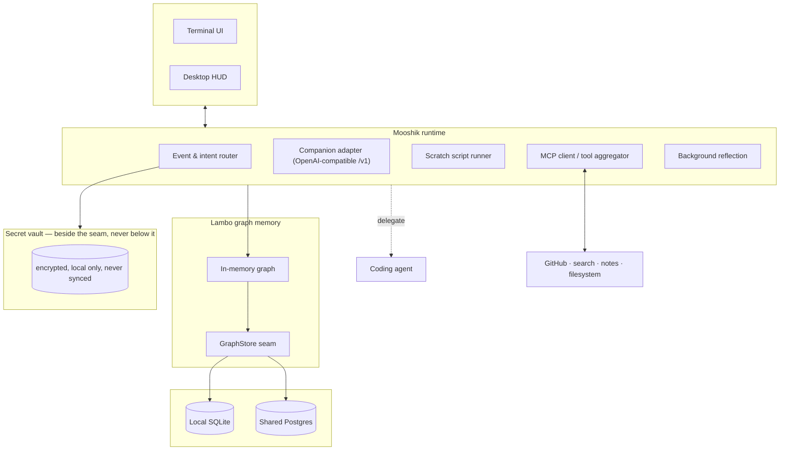

# Mooshik (മൂഷികൻ)

An ambient, local-first AI cowork partner and workspace orchestrator.

Coding agents are contractors: you summon one, it edits a repository, it exits, and it remembers
nothing. Cloud chatbots are amnesiac in a different way — they hold a conversation and forget the
work. Mooshik is neither. It runs continuously alongside you as a peer, holds a lifelong memory of
what you have built and decided, researches the web, connects to your tools over MCP, and hands
heavy code changes to a specialized coding agent rather than pretending to be one.

**License:** AGPLv3 (application and orchestration) · Lambo memory core: Apache 2.0
**Platforms:** Linux, macOS

---

## The triad

```
┌─────────────────────────────────────────────────────────────────────────────┐
│  🐭 MOOSHIK (AGPLv3)                 │  🐘 LAMBO (Apache 2.0)               │
│  The cowork partner & orchestrator   │  The living graph memory substrate   │
│  • Ambient, cross-repo awareness     │  • In-memory graph + write-behind    │
│  • Fast local chat                   │  • Earned canonization               │
│  • Web research & live scraping      │  • Structural blast-radius tracking  │
│  • Native MCP host & tool hub        │  • Local SQLite / shared Postgres    │
├──────────────────────────────────────┴──────────────────────────────────────┤
│  ⚡ The coding contractor                                                   │
│  • Surgical edits in repositories; reads canonical constraints from Lambo   │
└─────────────────────────────────────────────────────────────────────────────┘
```

### Why the name

**Lambodaran** (ലമ്പോദരൻ / Ganesha) is the deity of intellect, memory and the removal of
obstacles. **Mooshik** (മൂഷികൻ) is his companion and vahana — the mount that carries him.

The architecture follows the myth. Lambo is the vast, heavy memory; Mooshik is the companion that
carries it, moves through the world, and acts.

The Sanskrit root *mūṣ* (मुष्) means *to extract, to gather, to scurry away with* — which is the
job: scurry through the web, extract clean text, gather context, and bring it back to the graph.

---

## Coworking, not commanding

| | Command agents | Mooshik |
| :--- | :--- | :--- |
| **Relationship** | master → contractor | peer → coworker |
| **Scope** | one repository | the whole workspace |
| **Lifecycle** | spawn → task → exit | always on |
| **Focus** | diffs, tests, commits | recall, research, planning, triage |
| **Memory** | blind between sessions | a living graph that grows |

---

## Architecture



### The companion slot

Any OpenAI-compatible `/v1` endpoint — a local model on your own GPU, or a hosted one. Local is
the default posture: no per-prompt cost, no round trip, and it works on a plane.

The companion sees a deliberately small tool surface, because a small model given forty tools
routes badly:

* `search_web` · `fetch_page` — research, returned as clean Markdown
* `run_scratch_script` — throwaway Python or bash in a sandbox, with a hard timeout
* `lambo_recall` · `lambo_derive` · `lambo_stats` — read, write and inspect memory
* `delegate_to_omp` — hand a real code change to the coding agent

### Memory that has to be earned

Not everything said becomes a fact. Concepts enter the graph as ordinary memory and are promoted
only as they prove themselves — recurring across sessions, surviving garbage collection,
accumulating confirmations and successful actions, and losing ground when they are reverted.

Only promoted concepts become load-bearing: surfaced as warnings before you touch something they
constrain, with the blast radius and the last action that touched it.

> *"`auth schema` is canonical (blast radius 9). Modified 2 sessions ago by `fix token rotation`."*

Different kinds of knowledge decay at different rates. A stated constraint resists eviction far
longer than a passing observation.

### Two stores, split by purpose

Mooshik keeps memory and secrets in separate places, rather than keeping them together and
filtering on the way out.

**The graph** is queryable, embedded, recalled by meaning, synced across your machines, readable
by models. **The vault** is encrypted, local only, never synced, never embedded, and never
rendered into a prompt or a transcript.

The graph may record that a credential *exists* and where it lives — genuinely useful
autobiographical knowledge, and safe to sync. It never holds the value. Values resolve locally at
the moment of use and are injected into *tools*, never into a model's context. Tool output is
scanned before it reaches the model, because output is where a secret actually escapes.

Nothing has to be stripped out of the graph on its way to the cloud, because secrets were never in
the graph.

### Autonomy is granted, not configured

There is no agent mode, no persona, no trust level to raise. **Mooshik's autonomy is exactly the
sum of what you have granted it**, enumerated in configuration and enforced at the tool-call
boundary:

```toml
[permissions]
memory          = ["recall", "derive"]
scratch         = "prompt"
web             = "deny"
filesystem_read = ["~/work"]
```

You widen what it may touch, and its independence widens with it. This matters more here than for
a command agent, because Mooshik is always on: the question *"what may it do while I am not
looking"* has to have an exact answer.

The graph is never a permission authority. No concept, however canonical, can widen a grant.

### Storage

**Local:** a single SQLite file. Standalone, offline, no services to run.

**Shared:** Postgres with pgvector, so a desktop and a laptop flush into one database and you get a
single unified memory across every machine you work on.

All networking and sync live below the `GraphStore` seam. The vault sits beside that seam — no
storage adapter and no sync path can reach it.

---

## Roadmap

**Phase 1 — Terminal.** A single Rust binary: memory in process, a streaming local companion, web
research, the scratch runner, and the MCP connector hub.

**Phase 2 — Desktop.** A native app with a global summon hotkey, an interactive view of the memory
graph, tray presence and notifications, and a live activity feed.

---

## Status

Early. Phase 1 is under construction, and this document describes where it is going rather than
what you can install today.
