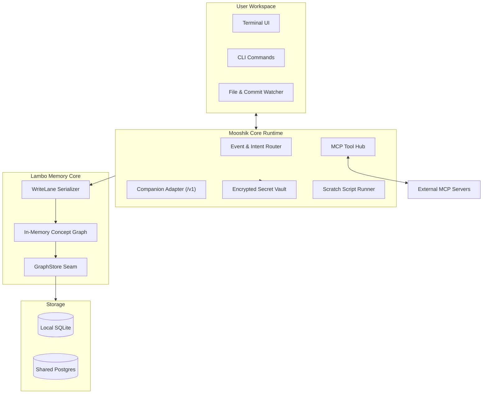

Mooshik connects terminal user interfaces, companion language models, local memory graphs, and external tools through a clean modular pipeline.

## System Diagram

## Core Subsystems

### 1. The Interactive Router
The router handles inbound user commands and keystrokes. It coordinates tool execution, prompt dispatch, and memory queries.

### 2. The Companion Adapter
The companion talks to any OpenAI-compatible API endpoint. It streams tokens directly into the terminal UI and handles tool call invocations cleanly.

### 3. The Memory Substrate
Lambo maintains an in-memory knowledge graph with background write-behind persistence. It stores entities, logic, constraints, resources, and observations.

### 4. The MCP Host
Mooshik spawns standard input and output MCP servers as child processes. It manages tool discovery, argument validation, and credential injection.

### 5. The Secret Vault
The vault protects sensitive connection strings and API keys. It redacts secrets before sending prompts to language models.
