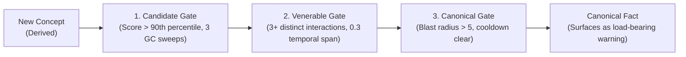

In Lambo, a concept does not become permanent because an agent marked it important. Concepts must earn promotion through structural evidence and recurrence across distinct sessions.

## The Promotion Pipeline

Concepts progress through three sequential promotion gates:

### 1. Candidate Gate

To become a Candidate, a concept must:
- Survive at least 3 background garbage collection sweeps.
- Score strictly above the 90th percentile of its non-canonical peers.

The threshold uses nearest-rank percentile scoring against real peer scores rather than artificial constants.

### 2. Venerable Gate

To advance from Candidate to Venerable, a concept must demonstrate temporal breadth:
- Accumulate at least 3 inbound structural edges from distinct origin interactions.
- Cover at least 0.3 of the session's total temporal extent.
- Edges younger than 60 seconds do not count toward temporal spread.

### 3. Canonical Gate

To achieve Canonical status, a concept must demonstrate architectural weight:
- Possess a structural blast radius strictly greater than 5.
- Remain outside the 300-second re-promotion cooldown to prevent flapping oscillations.

Every promotion writes an immutable audit row to the database.

## The Event-Time Clock

Promotion requires evidence across distinct sessions over time.

During bulk repository ingestion, years of commit history can be loaded in an hour. If promotion gates measured wall-clock flush time, a decade of engineering decisions would appear as a single afternoon.

Lambo addresses this with an injectable **event clock**:
- Clients pass an optional `event_time` (such as git commit author date or file modification timestamp).
- Lambo measures temporal extent and recurrence using `event_time`.
- `created_at` remains server-stamped to preserve security boundaries.

## Auditability

Promotion events generate permanent log records:
- Timestamp and previous gate status.
- Exact composite score and percentile values.
- Blast radius and contributing edge IDs.

Read the [Lambo Canonization guide](https://nrynss.github.io/lambo/canonization/) for mathematical proofs and benchmark transcripts.
