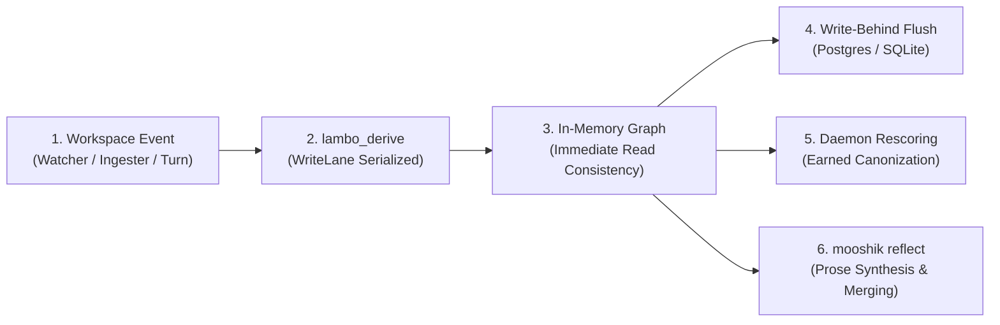

Mooshik links Lambo directly in-process via the `lambo` Rust crate.

Instead of treating memory as a flat text log, Lambo maintains an in-memory directed property graph backed by asynchronous write-behind storage.

## Concept Types

Lambo categorizes extracted knowledge into five distinct concept types:

1. **`entity`:** Named components, services, tools, databases, and workspace systems.
2. **`logic`:** Invariants, algorithms, transformation steps, and procedural rules.
3. **`constraint`:** Technical boundaries, port allocations, architectural limits, and version caps.
4. **`resource`:** File paths, documents, git commit references, URLs, and screenshots.
5. **`observation`:** Empirical outcomes, test results, benchmarks, and performance measurements.

Different concept types decay at different rates. Constraints resist eviction longer than passing observations.

## Graph Relations

Edges in the graph express structural relationships between concepts:

- **`parent_of`:** Represents hierarchical ownership and component containment.
- **`derives`:** Connects source documents or observations to derived concepts.
- **`depends_on`:** Tracks operational dependencies between components.
- **`constrains`:** Attaches constraints and boundaries to target entities.

## Companion Memory Tools

Mooshik exposes three in-process memory tools to the companion model:

| Tool | Purpose | Output |
| :--- | :--- | :--- |
| `lambo_recall` | Queries the graph using semantic similarity and graph traversal. | Returns ranked concepts with relevance scores and blast radius. |
| `lambo_derive` | Writes new concepts and edges into the in-memory graph. | Returns confirmation of created or updated concept IDs. |
| `lambo_stats` | Inspects graph size, node counts, and durability metrics. | Returns node counts, edge counts, and flush queue depth. |

## The Memory Lifecycle

1. **Extraction:** The watcher, conversational turn, or MCP server extracts concepts from activity.
2. **Derivation:** Concepts are written to memory through `lambo_derive`, serialized by `WriteLane`.
3. **Storage:** The in-memory graph updates immediately, followed by asynchronous write-behind flushes.
4. **Rescoring:** The background daemon computes structural scores across time.
5. **Consolidation:** `mooshik reflect` merges paraphrase twins and synthesizes timeline prose.
