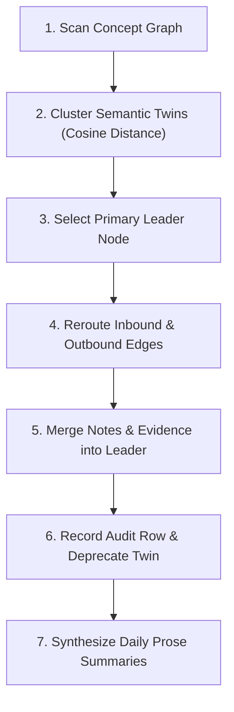

`mooshik reflect` is Mooshik's consolidation and synthesis engine. It prevents graph fragmentation, unifies semantic duplicates, and writes descriptive timeline prose.

## The Consolidation Pipeline

Over days of continuous work, multiple tools and conversations derive concepts that describe identical facts using different words.

`mooshik reflect` performs a consolidation pass over unanalyzed interactions:



### Merging Paraphrase Twins

When two concepts represent the same factual invariant:
- **Leader determination:** The concept with more supporting structural edges or richer content is selected as the primary node.
- **Edge rerouting:** All `depends_on`, `constrains`, and `parent_of` edges pointing to the twin are redirected to the leader.
- **Content preservation:** Any unique observations or resource links attached to the twin are merged into the leader's metadata.
- **Audit trail:** An audit entry records the source node ID, target leader ID, and timestamp.

### Timeline Prose Synthesis

Raw workspace events can be difficult to scan quickly. Reflection synthesizes narrative summaries formatted for the terminal pane:

- **Daily moods:** Describes the general focus of the day (such as "Infrastructure hardening" or "Incident remediation").
- **Gutter summaries:** Four-word summaries rendered along the left margin of the daily log.
- **Thread rationales:** Explains why related commits and changes occurred together.

These are written as `mooshik-prose:` concepts. The terminal pane displays them on its next 250 millisecond redraw cycle.

## Idempotence and Verification

- **First-write-only:** Reflection records the timestamp of analyzed epochs. Rerunning `mooshik reflect` immediately after a successful run performs no changes.
- **Dry-run reporting:** Use `--dry-run` to preview planned concept merges and generated prose before committing changes:

```bash
mooshik reflect --dry-run
```
