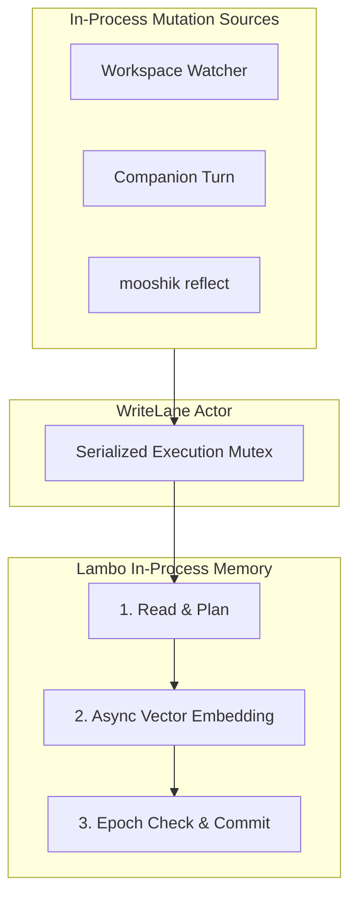

Mooshik enforces strict concurrency boundaries to protect memory integrity and eliminate write conflicts.

## The Single-Writer Lease

Only one process may hold write access to a given session at any time.

When `mooshik tui`, `mooshik chat`, or `mooshik serve` starts, it acquires an exclusive lease on the target database:
- **Collision rejection:** If another process attempts to open the same session directly, Mooshik refuses with an explanatory conflict message and exits with status code 2.
- **Clean release:** When the session shuts down cleanly, it releases the lease.
- **Automatic expiration:** If a process crashes without clean shutdown, the lease expires automatically after a short timeout.

### Proxying via `mooshik serve`

Lambo allows secondary processes to connect to an active session holder. When `mooshik serve` detects an existing lease holder on the same session, it proxies write operations into the active process over a local IPC endpoint.

## In-Process WriteLane

Within a single Mooshik process, multiple asynchronous tasks can attempt to write to memory simultaneously:
- The workspace watcher observing file modifications.
- The active conversational turn generating new observations.
- Background reflection runs.

### Optimistic Commit Protection

Lambo performs graph mutations optimistically:
1. It plans the update under a read lock.
2. It generates vector embeddings across an asynchronous boundary without holding locks.
3. It commits changes only if the graph epoch remains unchanged.

If high in-process concurrency causes the epoch to move during embedding generation, Lambo must retry the plan.

Mooshik wraps all internal derive operations in a serialized `WriteLane` mutex. This guarantees that internal tasks queue cleanly rather than competing for optimistic commits.
